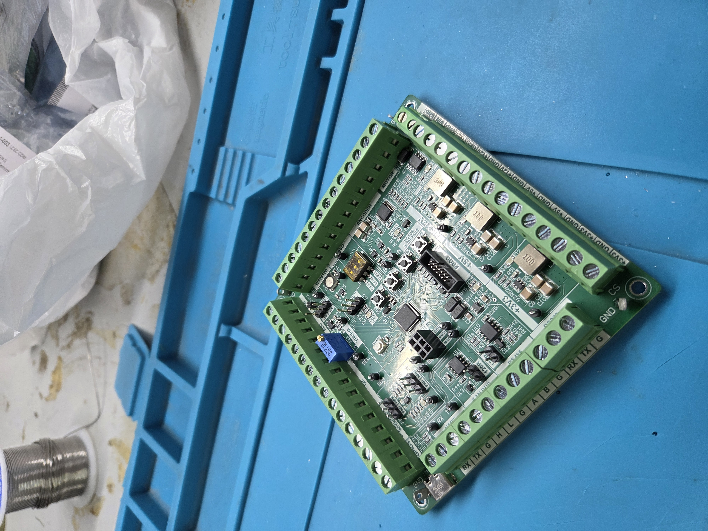
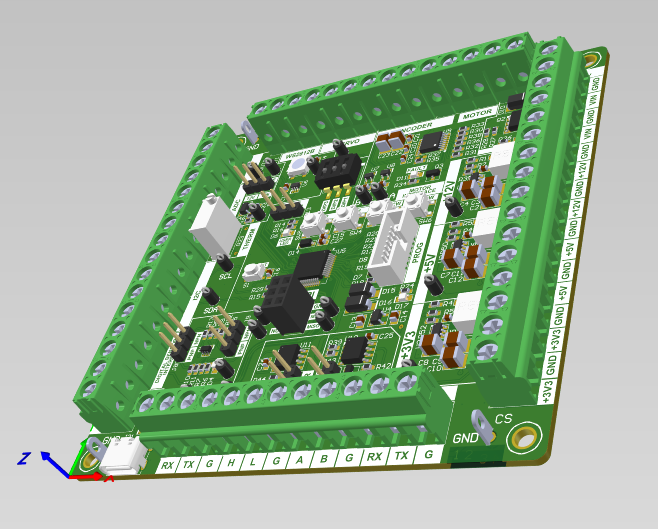
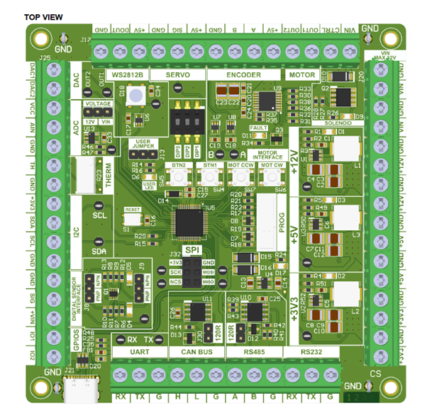
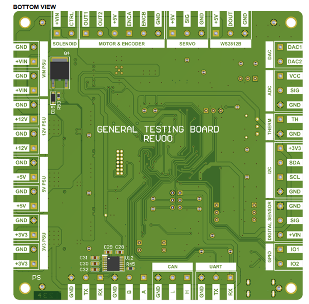
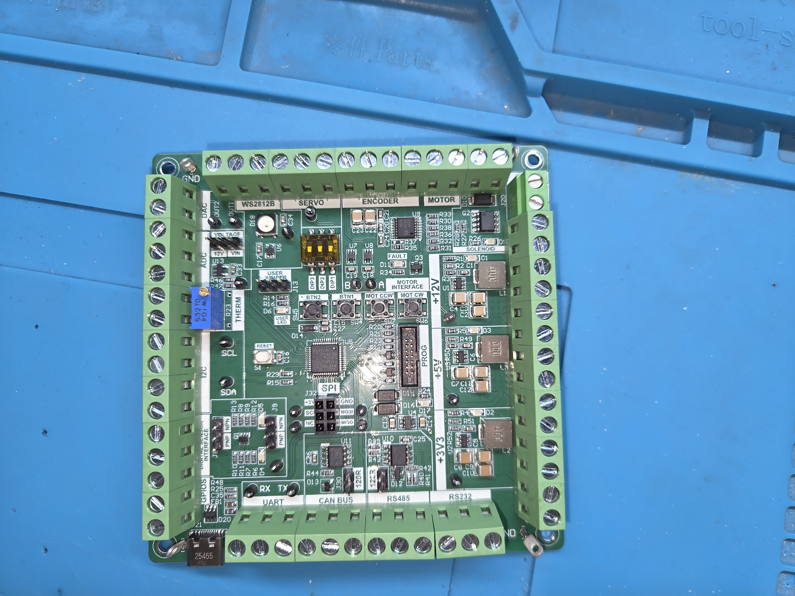
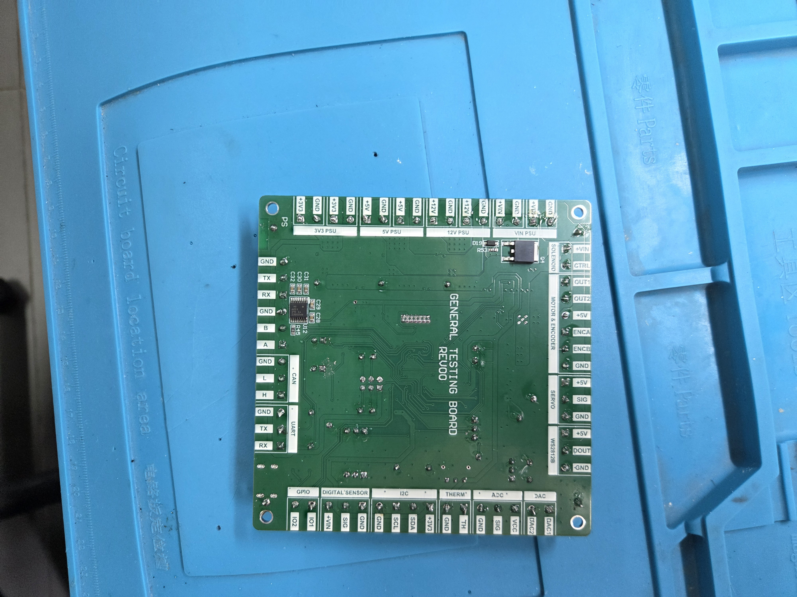

# General Purpose STM32G0 Development Board

Welcome to the General Purpose STM32G0 Development Board project repository! This project features a comprehensive testing and development PCB designed around the STM32G0 microcontroller. The board is engineered to integrate multiple industrial and hobbyist protocols into a single platform, including DC-DC power management, motor drivers, and versatile communication interfaces[cite: 1]. The project includes manufacturing files (Gerber), Bill of Materials (BOM), Pick and Place files, and the STM32 configuration file.
Use [STM32CubeIDE](https://www.st.com/en/development-tools/stm32cubeide.html) to manage and upload the code to the STM32 microcontroller.
## Developer
- **Name**: Lidor Simhi
- **GitHub**: [LidorSimhi](https://github.com/Meluhlah)

 

## Contents

- [Description](#description)
- [Components](#components)
- [Folder Structure](#folder-structure)
- [Usage](#usage)
- [Credits](#credits)
- [Sponsors](#sponsors)
- [License](#license)

## Description

This project is a general-purpose testing board designed for educational purposes, rapid prototyping, and industrial application testing.
The board is built to handle mixed-voltage systems with onboard DC-DC converters for 12V, 5V, and 3.3V rails. 
It supports a wide range of actuators, including DC motors with encoders, Servos, and inductive loads like solenoids.

The board features extensive connectivity options, supporting industrial standards such as CAN BUS, RS485, and RS232, alongside standard UART, I2C, and SPI interfaces.

### The inputs and outputs are designed for versatility:
- **Analog Inputs**: 0-10V Industrial ADC Input and Thermistor support.
- **Digital I/O**: Selectable NPN/PNP Digital Sensor interfaces and addressable LED support (WS2812B).

## Components

The development board features the following components:

- **Microcontroller**:
    - STM32G0 Series MCU (U5).

- **Power Management**:
    - Input Voltage: VIN Max 32V.
    - DC-DC Converters: 12V, 5V, 3.3V.
    - Dedicated 3.3V LDO for MCU.

- **Communication**:
    - **Industrial**:
        - [CAN BUS](https://www.iso.org/standard/63533.html) .
        - [RS485](https://en.wikipedia.org/wiki/RS-485) .
        - [RS232](https://en.wikipedia.org/wiki/RS-232) .
    - **Standard**:
        - UART (RX/TX).
        - I2C (SDA/SCL).
        - SPI (SCK, MOSI, MISO, NCS).
        - USB 2.0 Interface.

- **Actuators & Drivers**:
    - **Motors**:
        - H-Bridge for DC Motor Control (CW/CCW).
        - Incremental Encoder Interface.
        - Servo Motor Header.
    - **Loads**:
        - Inductive Load Driver (Solenoid).
        - Addressable LED Header (WS2812B).

- **Sensors & IO**:
    - 2 x DAC Outputs.
    - Thermistor Input.
    - Digital Sensor Interface (PNP/NPN Selectable).
    - User Buttons & LEDs.

- **Files Included**:
    - Full BOM and Pick & Place files can be found:
       [Bill of Materials](./Hardware/BOM_JLCPCB_PCB.xlsx)
       [Pick and Place](./Hardware/Pick_Place_JLCPCB_PCB.csv)

## Folder Structure

The repository is organized as follows:

/[Firmware](./Firmware/)
 &nbsp;&nbsp;&nbsp;&nbsp;├── [STM32_Config](./Firmware/STM32_Config/) &nbsp;&nbsp;&nbsp;# .ioc configuration files for STM32Cube
 &nbsp;&nbsp;&nbsp;&nbsp;├── [src](./Firmware/src/)&nbsp;&nbsp;&nbsp;&nbsp;&nbsp;&nbsp;&nbsp;&nbsp;&nbsp;&nbsp;&nbsp;&nbsp;&nbsp;&nbsp;&nbsp;&nbsp;&nbsp;&nbsp;&nbsp;&nbsp;&nbsp;&nbsp;&nbsp;&nbsp; # Source code examples
 /[Hardware](./Hardware/)
 &nbsp;&nbsp;&nbsp;&nbsp;├── [Gerbers](./Hardware/Gerbers/)&nbsp;&nbsp;&nbsp;&nbsp;&nbsp;&nbsp;&nbsp;&nbsp;&nbsp;&nbsp;&nbsp;&nbsp;&nbsp;&nbsp;&nbsp;&nbsp;&nbsp;&nbsp;&nbsp;&nbsp; # Gerber files for PCB Manufacturing
 &nbsp;&nbsp;&nbsp;&nbsp;├── [BOM](./Hardware/BOM/) &nbsp;&nbsp;&nbsp;&nbsp;&nbsp;&nbsp;&nbsp;&nbsp;&nbsp;&nbsp;&nbsp;&nbsp;&nbsp;&nbsp;&nbsp;&nbsp;&nbsp;&nbsp;&nbsp;&nbsp;&nbsp;&nbsp;&nbsp;&nbsp;&nbsp;&nbsp;# Bill of Materials
 &nbsp;&nbsp;&nbsp;&nbsp;├── [PickAndPlace](./Hardware/PickAndPlace/) &nbsp;# Automated assembly files
 /[Docs](./Docs/) &nbsp;&nbsp;&nbsp;&nbsp; # Datasheets for components and Pinout Diagrams
 /[Images](./images/) &nbsp;&nbsp;&nbsp;&nbsp; # Datasheets for components and Pinout Diagrams
 /README.md

## Usage

To replicate or use this project, follow these steps:

1. **Manufacturing**:
    - Use the provided Gerber files in `\Hardware\Gerbers` to order the PCB.

2. **Assembly**:
    - Assemble the components using the BOM and Pick & Place files found in `\Hardware`.
    - Ensure the correct selection of NPN/PNP jumpers for your digital sensors.

3. **Electronics**:
    Connect your peripherals according to the board labels:
    - **Power**: Connect up to 32V DC to the VIN terminal.
    - **Motors**: Connect DC motors to the "MOTOR" terminal and Servos to the "SERVO" header.
    - **Comms**: Use J30/J21 for communication interfaces.

4. **Programming**:
    - Open the `.ioc` file in `\Firmware\STM32_Config` using STM32CubeIDE or STM32CubeMX.
    - Generate the code and flash the STM32G0 MCU using the PROG interface.

5. **Debugging**:
    - Use the onboard TEST POINTS and User LEDs for easy debugging.

## Credits

This project was created to provide a robust general-purpose testing platform. Feel free to contribute by submitting pull requests or reporting issues.

## Sponsors 
A huge thanks to [PCBWay](https://pcbway.com/g/lxAijI) for sponsoring this project! 
Their support didn't stop at manufacturing – their team provided incredible post-shipping customer service and actively helped me navigate customs clearance to ensure the boards arrived safely and without delay. Highly recommended!

[PCBWay](https://pcbway.com/g/lxAijI)  is a one-stop solution for PCB prototyping, manufacturing, and assembly, as well as 3D printing services. Their high-quality products and excellent customer service make them a top choice for electronics enthusiasts and professionals alike.\
Visit [PCBWay](https://pcbway.com/g/lxAijI) for more information on their services and to get started on your own projects!

## License

This project is licensed under the [MIT License](LICENSE). Feel free to use, modify, or distribute this code and design for personal or educational purposes.
